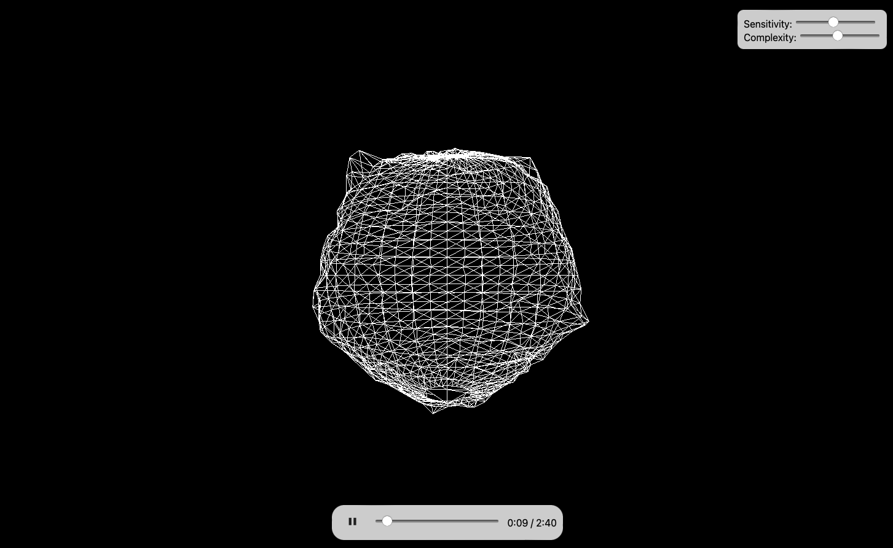

# AudioSphere



AudioSphere is an interactive 3D audio visualizer that creates mesmerizing sphere deformations based on audio input. Upload your favorite music and watch as the sphere pulsates and morphs in sync with the beats and rhythms!

## Features

- Real-time 3D audio visualization using Three.js
- Interactive sphere that responds to audio frequencies
- Adjustable sensitivity and complexity
- Draggable rotation for a 360° view
- Audio playback controls with seek functionality

## Demo


## How It Works

AudioSphere uses the Web Audio API to analyze audio data and Three.js to render a responsive 3D sphere. Here's a breakdown of the key components:

### Audio Analysis

The `initAudio()` function sets up the audio context and analyzer:

```javascript
function initAudio(arrayBuffer) {
    audioContext = new (window.AudioContext || window.webkitAudioContext)();
    analyser = audioContext.createAnalyser();
    
    audioContext.decodeAudioData(arrayBuffer, (buffer) => {
        // ... set up audio buffer and controls
    });
}
```

This function initializes the audio context, creates an analyzer, and decodes the audio data for playback and analysis.

### Sphere Generation

The `updateSphere()` function creates the 3D sphere using Three.js:

```javascript
function updateSphere() {
    const geometry = new THREE.SphereGeometry(1, complexity, complexity);
    const material = new THREE.MeshBasicMaterial({ color: 0xffffff, wireframe: true });
    sphere = new THREE.Mesh(geometry, material);
    scene.add(sphere);
    // ... save original vertices and initialize noise
}
```

This function generates a wireframe sphere with adjustable complexity.

### Audio-Reactive Animation

The `animate()` function is the heart of AudioSphere, creating the audio-reactive deformations:

```javascript
function animate() {
    // ... get audio data
    for (let i = 0; i < positions.count; i++) {
        // ... calculate audio offsets and deformations
        const deformation = Math.sin(5 * theta + time) * Math.cos(3 * phi + time) * combinedOffset * sensitivity / 30;
        // ... apply deformations to sphere vertices
    }
    // ... update geometry and render
}
```

This function analyzes the audio data in real-time and applies deformations to the sphere's vertices based on the audio frequencies and user-defined sensitivity.

## Getting Started

1. Clone the repository:
   ```
   git clone https://github.com/jonaskroedel/AudioSphere.git
   ```

2. Open `index.html` in a modern web browser.

3. Click the "Upload Audio" button and select an audio file.

4. Enjoy the visualization! Use the play/pause button and progress bar to control audio playback.

## Usage

- **Sensitivity**: Adjust the slider to change how dramatically the sphere reacts to the audio.
- **Complexity**: Modify the number of vertices in the sphere for more detailed or smoother deformations.
- **Rotation**: Click and drag on the sphere to rotate it and view from different angles.

## Contributing

Contributions are welcome! Please feel free to submit a Pull Request.

## License

GNU GP-L3.0

## Acknowledgements

- [Three.js](https://threejs.org/) for 3D rendering
- [Web Audio API](https://developer.mozilla.org/en-US/docs/Web/API/Web_Audio_API) for audio processing

---

Created by [Your Name] - [Your Website/GitHub Profile]